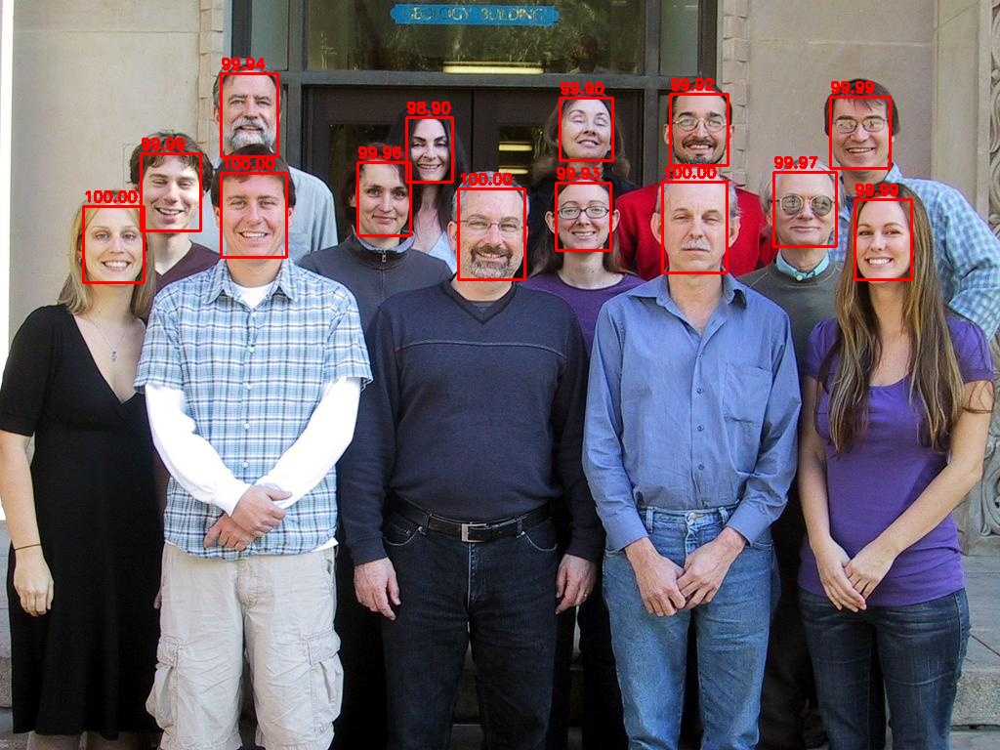

# Ultra Light

Ultra Light Fast Generic Face Detector 👨‍👩‍👧‍👦🖼



Very fast and quality face detector. Can use CPU, GPU and MPS (Apple M1 ML) providers.
Work via ONNX model


## Installation

```bash
pip install ultralight
```


## Usage sample

```python
import cv2
from ultralight import UltraLightDetector
from ultralight.utils import draw_faces

image = cv2.imread('sample.jpg')

detector = UltraLightDetector()
boxes, scores = detector.detect_one(image)
print(f'Found {len(boxes)} face(s)')
# >>> Found 14 face(s)

draw_faces(image, boxes, scores)
cv2.imshow('result', image)
cv2.waitKey(0)
```

This sample can be found [here](samples/sample.py)


## Reference

[GitHub repository of original detector](https://github.com/Linzaer/Ultra-Light-Fast-Generic-Face-Detector-1MB)

[ArXiv paper of original detector](https://arxiv.org/pdf/1905.00641.pdf)


## More

PyPI: https://pypi.org/project/ultralight

Repository: https://github.com/abionics/UltraLight

Developer: Alex Ermolaev (Abionics)

Email: abionics.dev@gmail.com

License: MIT (see LICENSE.txt)
